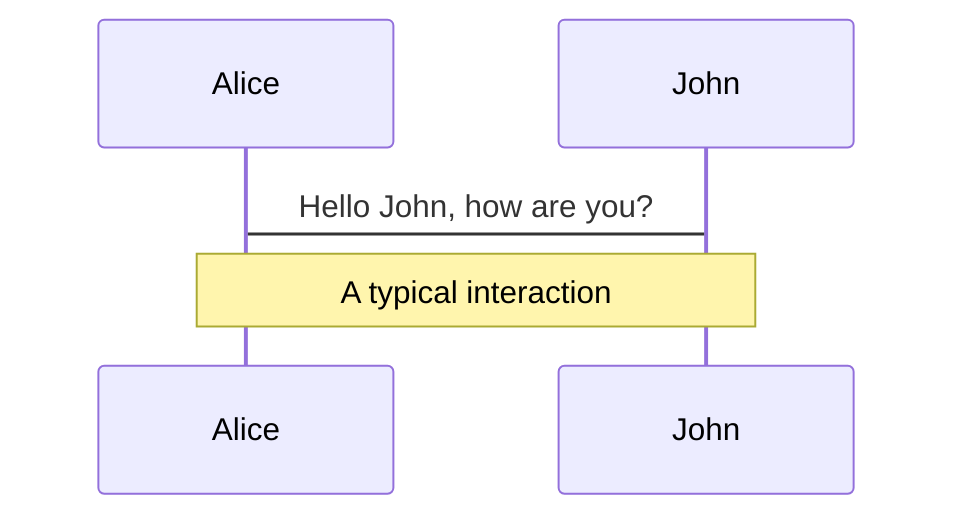
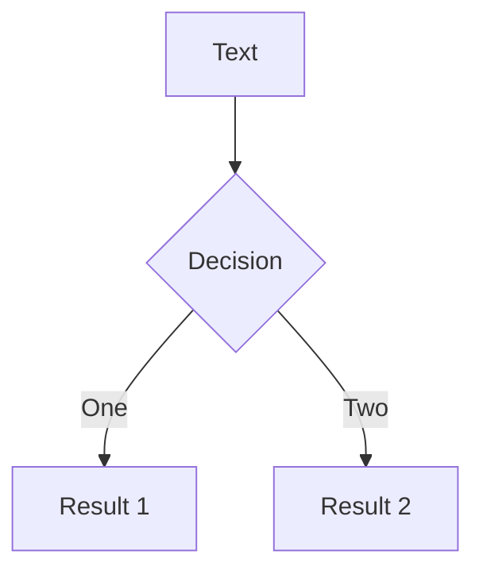

---
# try also 'default' to start simple
theme: seriph
# random image from a curated Unsplash collection by Anthony
# like them? see https://unsplash.com/collections/94734566/slidev
background: https://source.unsplash.com/collection/94734566/1920x1080
# apply any windi css classes to the current slide
class: 'text-center'
# https://sli.dev/custom/highlighters.html
highlighter: shiki
# show line numbers in code blocks
lineNumbers: false
# some information about the slides, markdown enabled
info: |
  ## Slidev Starter Template
  Presentation slides for developers.

  Learn more at [Sli.dev](https://sli.dev)
---

# hxm-vscode-download-icon插件

Presentation slides for developers

<div class="pt-12">
  <span @click="$slidev.nav.next" class="px-2 py-1 rounded cursor-pointer" hover="bg-white bg-opacity-10">
    Press Space for next page <carbon:arrow-right class="inline"/>
  </span>
</div>

<div class="abs-br m-6 flex gap-2">
  <button @click="$slidev.nav.openInEditor()" title="Open in Editor" class="text-xl icon-btn opacity-50 !border-none !hover:text-white">
    <carbon:edit />
  </button>
  <a href="https://github.com/slidevjs/slidev" target="_blank" alt="GitHub"
    class="text-xl icon-btn opacity-50 !border-none !hover:text-white">
    <carbon-logo-github />
  </a>
</div>


<!--
The last comment block of each slide will be treated as slide notes. It will be visible and editable in Presenter Mode along with the slide. [Read more in the docs](https://sli.dev/guide/syntax.html#notes)
-->

---
preload: false
layout: center
---

<segment-title>Background</segment-title>

---

# Daily Work On Downloading Icon

<br>
<br>

<v-clicks>

* 打开 [设计中台](https://datav.iwencai.com/resource/page/index.html#/iconfont)
* 搜索图标 -> 下载图标
* Repeat Step2
* 从杂乱的`Downloads`目录中找到刚刚下载的图标
* 将图标传输至内网
* 拷贝到项目的文件夹内
* Reapeat All

</v-clicks>

---
preload: false
layout: center
---

<h1>
  
  <p v-motion
  :initial="{scale:2}"
  :enter="{scale: 1, transition: {duration: 600}}">Crazy! 😫</p>
</h1>

<style>
p {
  text-align: center;
  margin-top: 50px;
}
</style>

---
preload: false
layout: center
---

<h1>
  
</h1>

<style>
img {
  border-radius: 12px;
  border: 12px solid transparent;
  border-image: linear-gradient(to top, #F80, #2ED);
  border-image-slice: 10;
}
</style>

<!--
1. 这里可以讲一下站在我组件库这边的角度的痛点，Icon组件用不起来
2. Icon组件的心路历程
  2.1 常用组件库使用的ttf字体图标，但是我们的大多是色彩多样的svg
  2.2 svg-symbols.js 但是将设计中台的集成到组件库内部是不可能的，体积太大
  2.3 所以当时只内置了十多个图标在组件库内，10多k, 但是根本无法满足大家对于Icon的使用需求
3. 因此当时搁置了比较长的时间
-->

---
preload: false
layout: center
---

<h1 class="segment-title">
What is hxm-vscode-download-icon?
</h1>

---
preload: false
layout: center
---

# Demo

<br>

<video controls>
  <source src="/demo.mp4" type="video/mp4">
</video>

<style>
video {
  width: 700px;
}
</style>

<!--
1. 这里讲一下安装 简单给大家看一下 vscode market中的md
2. 一定要讲一下配合组件库如何使用，提前准备好demo
-->

---

# Main Feature

<div class="grid grid-cols-[1.5fr,4.2fr] gap-4">
  <div class="flex flex-col justify-center items-center pb-4">
    
    <h3 style="text-align: center">hxm-vscode-download-icon</h3>
  </div>
  <div class="border-l border-gray-400 border-opacity-25 !all:leading-12 !all:list-none my-auto">
    <ul>
      <li>1. 将Icon平台功能集成于vscode插件内，随开随用</li>
      <li>2. 支持通过图标英文名搜索后进行批量选择</li>
      <li>3. 支持剔除已选择的图标</li>
      <li>4. 支持批量导出svg文件夹</li>
      <li>5. 支持批量打包输出为svg-symbols.js 结合hxm-icon组件直接使用</li>
      <li>6. 支持缓存功能，下次打开页面的时候依然展示退出页面前的搜索及选择结果</li>
      <li>7. 内外网通用</li>
    </ul>
  </div>
</div>

---
preload: false
layout: center
---

<segment-title>Plugin FrameWork</segment-title>

---
layout: image-right
image: https://source.unsplash.com/collection/94734568/1920x1080
---

# FrameWork

- 一、vscode插件基础框架搭建
- 二、侧边栏图标及目录树配置
- 三、在vscode中创建webview
- 四、核心功能 Core:
  - 工具选择
  - 搜索图标功能
  - 搜索图标列表展示与联动
  - 已选择图标列表展示
  - vscode插件与webview的通信
  - 数据缓存
  - 内外网兼容
- 五、插件发布

[Plugin Todos: XMind文档下载地址](https://github.com/PaulChess/tech-shares/raw/master/vscode-icon-share/public/plugin-todos.xmind)

<!--
1. 这里带大家过一下xmind, 记得提前打开
-->

---
preload: false
layout: center
---

<segment-title>Code Implements</segment-title>

---
preload: false
layout: center
---

[1. VSCode插件基础教程](https://mp.weixin.qq.com/s/yYGeE1ZYwW2MZWGTYXWG1g)

<!--
1. 这里简单带大家过一下脚手架、安装、如何启动调试插件
2. extension.js插件入口介绍、 我理解的vscode核心: 指令 >new file >new folder
3. Open Webview Developer Tools
4. 5-10分钟之间
-->

---

### 2. 侧边栏配置 package.json

```json {all|2-5|6|8-16|17-24|all}
{
  // 注册事件
  "activationEvents": [
    "onView: download_svg",
  ],
  // 注册视图
  "contributes": {
    "viewsContainers": {
      "activitybar": [
        {
          "id": "hxmui",
          "title": "SVG图标管理平台"
          "icon": "resources/sideIcon.svg"
        }
      ]
    },
    "views": {
      "hxmui": [
        {
          "id": "download_svg",
          "name": "同花顺Hux平台图标下载"
        },
      ]
    }
  }
}
```

<!--
1. viewsContainers: https://code.visualstudio.com/api/references/contribution-points#contributes.viewsContainers
2. views: https://code.visualstudio.com/api/references/contribution-points#contributes.views
3. 这里写个demo 带两个侧边栏
-->

---

### 2. 侧边栏配置 sidebarTree.js

```javascript
module.exports = class SideBarTree {
  // 类中必须要实现的两个接口 
  getTreeItem(element) {
    return element;
  }
  getChildren() {
    // 在这里面注册children 
    const r_cates = [
      {
        title: 'Home',
        icon: 'home.svg'
      }
    ];
    const fin_items = [];
    for (let i = 0; i < c_rates.length; i++) {
      fin_items.push(
        new DataItem(
          /** 实例化 */
        )
      )
    }
  }
}

class DataItem extends vscode.TreeItem {}
```

<!--
1. Tree View: https://code.visualstudio.com/api/extension-guides/tree-view
-->

---
preload: false
layout: center
---

### usage: **extension.js**

<br>

```javascript {2-9|all}
function active(context) {
  vscode.window.registerTreeDataProvider('download_svg', new SidebarTree(context));

  let openSite = vscode.commands.registerCommand('download_svg.openSite', () => {
    /**
     * 注册完事件的回调
     * 这里可以创建webview
     */
  })
}
```

---
preload: false
layout: center
---

### 3. 创建webview

<br>

```javascript
const panel = vscode.window.createWebviewPanel(
  'webview',
  '同花顺Hxmui-Icon',
  vscode.ViewColumn.One,
  {
    enableScripts: true,
    retainContextWhenHidden: true
  }
);

panel.iconPath = vscode.Uri.file(join(__dirname, 'resources', 'home.svg'));
panel.webview.html = getWebViewContent(context, 'views/index.html');
```

<!--
1. 大概介绍一下里面的一些参数
2. getContext方法
-->

---
preload: false
layout: center
---

### 3. function: getWebViewContent

<br>

```javascript
function getWebViewContent(context, templatePath) {
	const resourcePath = join(context.extensionPath, templatePath);
	const dirPath = dirname(resourcePath);
	let html = fs.readFileSync(resourcePath, 'utf-8');
    html = html.replace(/(<link.+?href="|<script.+?src="| {
	  if ($2.indexOf("https://") < 0) {
        return $1 + vscode.Uri.file(resolve(dirPath, $2)).with({ scheme: 'vscode-resource' }).toString() + '"';
      } else {
        return $1 + $2 + '"';
      }
	});
	return html;
}
```

---
layout: image-right
image: https://source.unsplash.com/collection/94734566/1920x1080
---

# Code

Use code snippets and get the highlighting directly![^1]

```ts {all|2|1-6|9|all}
interface User {
  id: number
  firstName: string
  lastName: string
  role: string
}

function updateUser(id: number, update: User) {
  const user = getUser(id)
  const newUser = {...user, ...update}  
  saveUser(id, newUser)
}
```

<arrow v-click="3" x1="400" y1="420" x2="230" y2="330" color="#564" width="3" arrowSize="1" />

[^1]: [Learn More](https://sli.dev/guide/syntax.html#line-highlighting)

<style>
.footnotes-sep {
  @apply mt-20 opacity-10;
}
.footnotes {
  @apply text-sm opacity-75;
}
.footnote-backref {
  display: none;
}
</style>

---

# Components

<div grid="~ cols-2 gap-4">
<div>

You can use Vue components directly inside your slides.

We have provided a few built-in components like `<Tweet/>` and `<Youtube/>` that you can use directly. And adding your custom components is also super easy.

```html
<Counter :count="10" />
```

<!-- ./components/Counter.vue -->
<Counter :count="10" m="t-4" />

Check out [the guides](https://sli.dev/builtin/components.html) for more.

</div>
<div>

```html
<Tweet id="1390115482657726468" />
```

<Tweet id="1390115482657726468" scale="0.65" />

</div>
</div>


---
class: px-20
---

# Themes

Slidev comes with powerful theming support. Themes can provide styles, layouts, components, or even configurations for tools. Switching between themes by just **one edit** in your frontmatter:

<div grid="~ cols-2 gap-2" m="-t-2">

```yaml
---
theme: default
---
```

```yaml
---
theme: seriph
---
```


</div>

Read more about [How to use a theme](https://sli.dev/themes/use.html) and
check out the [Awesome Themes Gallery](https://sli.dev/themes/gallery.html).

---
preload: false
---

# Animations

Animations are powered by [@vueuse/motion](https://motion.vueuse.org/).

```html
<div
  v-motion
  :initial="{ x: -80 }"
  :enter="{ x: 0 }">
  Slidev
</div>
```

<div class="w-60 relative mt-6">
  <div class="relative w-40 h-40">
    
    
    
  </div>

  <div 
    class="text-5xl absolute top-14 left-40 text-[#2B90B6] -z-1"
    v-motion
    :initial="{ x: -80, opacity: 0}"
    :enter="{ x: 0, opacity: 1, transition: { delay: 2000, duration: 1000 } }">
    Slidev
  </div>
</div>

<!-- vue script setup scripts can be directly used in markdown, and will only affects current page -->
<script setup lang="ts">
const final = {
  x: 0,
  y: 0,
  rotate: 0,
  scale: 1,
  transition: {
    type: 'spring',
    damping: 10,
    stiffness: 20,
    mass: 2
  }
}
</script>

<div
  v-motion
  :initial="{ x:35, y: 40, opacity: 0}"
  :enter="{ y: 0, opacity: 1, transition: { delay: 3500 } }">

[Learn More](https://sli.dev/guide/animations.html#motion)

</div>

---

# LaTeX

LaTeX is supported out-of-box powered by [KaTeX](https://katex.org/).

<br>

Inline $\sqrt{3x-1}+(1+x)^2$

Block
$$
\begin{array}{c}

\nabla \times \vec{\mathbf{B}} -\, \frac1c\, \frac{\partial\vec{\mathbf{E}}}{\partial t} &
= \frac{4\pi}{c}\vec{\mathbf{j}}    \nabla \cdot \vec{\mathbf{E}} & = 4 \pi \rho \\

\nabla \times \vec{\mathbf{E}}\, +\, \frac1c\, \frac{\partial\vec{\mathbf{B}}}{\partial t} & = \vec{\mathbf{0}} \\

\nabla \cdot \vec{\mathbf{B}} & = 0

\end{array}
$$

<br>

[Learn more](https://sli.dev/guide/syntax#latex)

---

# Diagrams

You can create diagrams / graphs from textual descriptions, directly in your Markdown.

<div class="grid grid-cols-2 gap-10 pt-4 -mb-6">





</div>

[Learn More](https://sli.dev/guide/syntax.html#diagrams)


---
layout: center
class: text-center
---

# Learn More

[Documentations](https://sli.dev) · [GitHub](https://github.com/slidevjs/slidev) · [Showcases](https://sli.dev/showcases.html)
